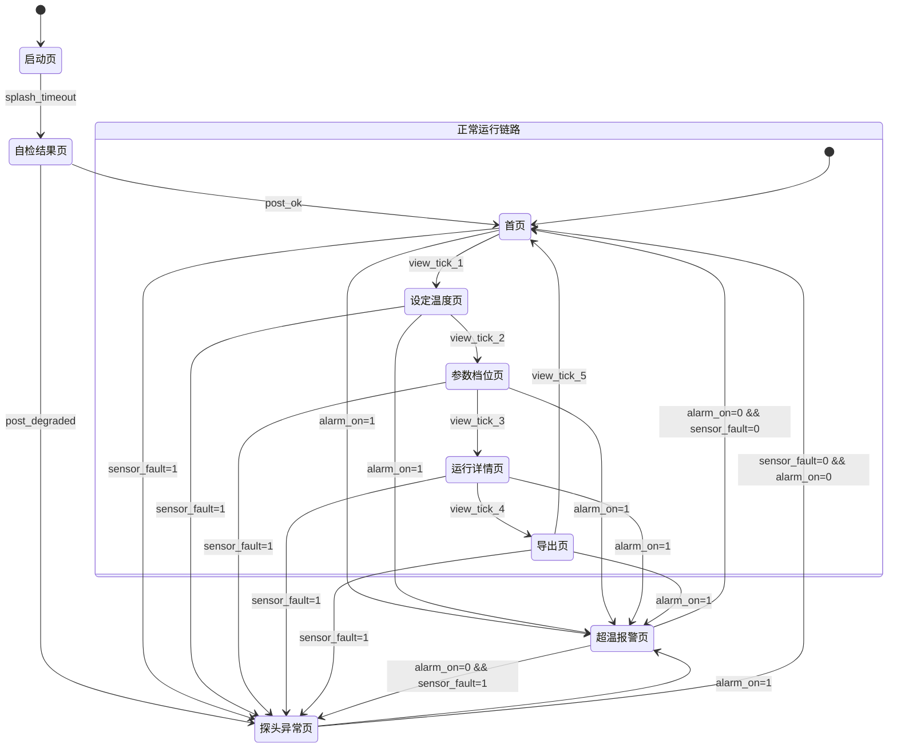

# UI 页面切换状态机与状态页示意（显示优先版）

- 适用设计稿：`docs/issue/lcd-ui-preview.html`
- 适用坐标清单：`docs/issue/lcd-ui-坐标与绘制清单.md`
- 适用伪代码模板：`docs/issue/ui_service-页面绘制伪代码模板.md`
- 目标：基于最新 UI 设计定义显示状态机切换流程，并给 MCU 工程师提供“先实现页面显示、暂不接按键”的落地路径。

说明：
- 本文优先约束“显示状态与页面渲染”。
- 按键事件暂不纳入状态切换条件，先用 mock 输入驱动状态切换与页面验证。

---

## 1. 状态定义范围（按最新 UI）

本状态机按当前 UI 视觉稿收敛为 9 个显示状态：

1. 启动页
2. 自检结果页
3. 首页
4. 设定温度页
5. 参数档位页
6. 运行详情页
7. 超温报警页
8. 探头异常页
9. 导出页

说明：
- 启动页和自检结果页属于上电流程状态。
- 首页、设定温度页、参数档位页、运行详情页、导出页属于正常运行链路。
- 超温报警页、探头异常页属于异常优先状态。
- 异常状态优先级高于正常运行链路。
- 当前阶段不依赖按键切换页面，页面切换由 mock 事件和系统状态驱动。

---

## 2. 显示状态机图（无按键版）



---

## 3. 切换原则（当前实现阶段）

1. 上电必须先经过启动页，再进入自检结果页。
2. 正常运行链路按环形页面切换：首页 -> 设定温度 -> 参数档位 -> 运行详情 -> 导出页 -> 首页。
3. 正常运行链路切换由 mock 事件 `view_tick_n` 或测试脚本触发，不依赖按键。
4. 编辑态暂不实现；页面以只读展示为主。
5. 报警和探头异常是高优先级插入态，触发后应立即打断普通浏览态。
6. 超温报警优先级高于探头异常页。
7. 异常解除后优先返回首页，避免用户停留在过时的上下文页面。

---

## 4. 状态与固件页枚举映射

当前固件页枚举见 `firmware/Core/Inc/ui_service.h`，建议按以下关系理解：

- `UI_PAGE_HOME` -> 首页
- `UI_PAGE_SET_TEMP` -> 设定温度页
- `UI_PAGE_PID` -> 参数档位页
- `UI_PAGE_ALARM` -> 正常时可映射运行详情页，告警时切换超温报警页
- `UI_PAGE_SCHEDULE` -> 自检结果页
- `UI_PAGE_EXPORT` -> 导出页
- `UI_PAGE_INFO` -> 探头异常页

说明：
- 启动页属于独立 splash 状态，不在 `ui_page_t` 环中轮转。
- 自检结果页和探头异常页当前更像“业务显示页”，而非纯菜单页。
- 若后续 UI 需要完全和视觉稿一一对应，建议把运行详情、自检结果、探头异常拆成独立枚举页值。

---

## 5. 每个状态的页面显示示意

以下示意只描述页面信息层级和布局骨架，不替代像素级坐标。

### 5.1 启动页

```text
┌────────────────────────┐
│                        │
│        水温            │
│        控制            │
│      ─────────         │
│    固定容积三点测温     │
│                        │
└────────────────────────┘
```

显示重点：
- 品牌识别
- 产品身份
- 不显示操作提示

### 5.2 自检结果页

```text
┌────────────────────────┐
│ 上电自检                │
│ 启动检查结果            │
│ ──────────────         │
│ 参数区     校验通过      │
│ 温度探头   2路可用       │
│ 运行结论   降级运行      │
│ 限制 预约功能已禁用      │
│ 检查结束后自动进入首页   │
│                    OK   │
└────────────────────────┘
```

显示重点：
- 当前是否可运行
- 是否进入降级
- 限制项说明

### 5.3 首页

```text
┌────────────────────────┐
│ 融合温度          加热中 │
│                        │
│ 58.2度                  │
│                        │
│ ──────────────         │
│ 目标              60.0度 │
│                        │
│ 加热开启 / 稳定运行     │
│ 安全余量 1.0度          │
│                 ◀ ▶    │
└────────────────────────┘
```

显示重点：
- 主温度
- 目标温度
- 当前运行状态
- 仅保留浏览符号提示

### 5.4 设定温度页

```text
┌────────────────────────┐
│ 设定温度                │
│ 步进零点五度            │
│ ──────────────         │
│ 目标值                  │
│ 60.0度                  │
│                        │
│ 当前融合58.2度          │
│ 设定保存 / 长按取消     │
│               OK ⤒     │
└────────────────────────┘
```

显示重点：
- 单参数编辑
- 主值卡片聚焦
- 明确保存/取消语义

### 5.5 参数档位页

```text
┌────────────────────────┐
│ 参数档位                │
│ 当前第二档 共三档       │
│ ──────────────         │
│ 当前档位                │
│ 平衡档                  │
│                        │
│ 快热 / 平衡 / 保温      │
│ 设定切换 / 长按退出     │
│               OK ◀     │
└────────────────────────┘
```

显示重点：
- 只暴露档位，不暴露 PID 明细
- 保持轻量编辑

### 5.6 运行详情页

```text
┌────────────────────────┐
│ 运行详情                │
│ 三点温度与控制          │
│ ──────────────         │
│ 上中下      59.0/58.4/57.2│
│ 控制输出           42%   │
│ 安全最高          59.0度 │
│ 目标60.0度 / 融合58.2度  │
│ 三点温度正常            │
│                 ◀ ▶    │
└────────────────────────┘
```

显示重点：
- 首页不显示的三点温度细节集中到本页
- 保持只读浏览属性

### 5.7 超温报警页

```text
┌────────────────────────┐
│ 超温报警                │
│ 温度超过阈值            │
│ ──────────────         │
│ 安全最高                │
│ 61.4度                  │
│                        │
│ 已强制停止加热          │
│ 恢复阈值58.0度 持续60秒 │
│                    OK   │
└────────────────────────┘
```

显示重点：
- 为什么停热
- 当前触发值
- 恢复条件
- 不显示浏览提示，只显示确认动作

### 5.8 探头异常页

```text
┌────────────────────────┐
│ 探头故障                │
│ 降级运行模式            │
│ ──────────────         │
│ 故障项     下层探头离线  │
│ 运行模式   降级运行      │
│ 输出上限   55%           │
│ 加热已受限 / 请检查连线  │
│ 每5秒自动重试           │
│                    OK   │
└────────────────────────┘
```

显示重点：
- 故障源
- 当前限制
- 建议动作

### 5.9 导出页

```text
┌────────────────────────┐
│ 日志导出                │
│ 串口输出                │
│ ──────────────         │
│ 日志条数                │
│ 128                     │
│                        │
│ 记录周期5秒             │
│ 串口命令 日志导出       │
│               OK ⤓     │
└────────────────────────┘
```

显示重点：
- 记录规模
- 导出方式
- 动作触发提示

---

## 6. 状态切换事件表（mock 驱动）

| 事件 | 来源状态 | 目标状态 | 说明 |
| --- | --- | --- | --- |
| `splash_timeout` | 启动页 | 自检结果页 | 启动画面播放结束 |
| `post_ok` | 自检结果页 | 首页 | 自检通过进入正常运行 |
| `post_degraded` | 自检结果页 | 探头异常页 | 自检降级，先提示故障 |
| `view_tick_n` | 正常运行链路页面 | 下一个页面 | 由 mock 测试脚本驱动轮换 |
| `alarm_on=1` | 任意正常页 | 超温报警页 | 高优先级打断 |
| `sensor_fault=1` | 任意正常页 | 探头异常页 | 次高优先级打断 |
| `alarm_on=0 && sensor_fault=0` | 超温报警页 | 首页 | 异常解除，回主页面 |
| `alarm_on=0 && sensor_fault=1` | 超温报警页 | 探头异常页 | 超温解除了但探头仍异常 |
| `sensor_fault=0 && alarm_on=0` | 探头异常页 | 首页 | 故障恢复回正常链路 |
| `alarm_on=1` | 探头异常页 | 超温报警页 | 升级为更高优先级异常 |

---

## 7. MCU 实施计划（先显示、后按键）

### 7.1 实施边界

1. 本阶段仅实现页面渲染和状态切换，不接真实按键输入。
2. 状态输入全部来自 mock 数据源（测试脚本或调试任务喂入）。
3. 所有页面必须可被 mock 事件切换并稳定刷新。

### 7.2 建议数据结构

```c
typedef struct
{
    uint8_t splash_timeout;
    uint8_t post_ok;
    uint8_t post_degraded;
    uint8_t alarm_on;
    uint8_t sensor_fault;
    uint8_t view_tick;      /* 每次+1触发正常运行链路下一个页面 */

    float t_top;
    float t_mid;
    float t_bot;
    float t_fused;
    float set_temp;
    float alarm_threshold;
    uint8_t heater_on;
    uint8_t log_count;
} ui_mock_input_t;
```

### 7.3 建议接口

```c
void ui_display_sm_init(void);
void ui_display_sm_feed_mock(const ui_mock_input_t *in);
ui_page_t ui_display_sm_current_page(void);
void ui_display_render_current_page(void);
```

### 7.4 每页实现顺序

1. 启动页 + 自检结果页（上电链路先通）。
2. 首页 + 设定温度页 + 参数档位页（主链路骨架）。
3. 运行详情页 + 导出页（补全正常运行链路）。
4. 超温报警页 + 探头异常页（异常打断链路）。

### 7.5 Mock 联调脚本建议

1. Case A（正常）：`splash_timeout -> post_ok -> view_tick` 连续触发 5 次，检查页面环路闭合。
2. Case B（告警打断）：在任意正常页注入 `alarm_on=1`，应立即切到超温报警页；清零后回首页。
3. Case C（探头故障）：在任意正常页注入 `sensor_fault=1`，应切到探头异常页；恢复后回首页。
4. Case D（双异常优先级）：`sensor_fault=1` 后再注入 `alarm_on=1`，应升级到超温报警页。
5. Case E（自检降级）：`splash_timeout -> post_degraded`，应先进入探头异常页。

### 7.6 验收标准

1. 9 个页面都能通过 mock 输入触发并正确显示。
2. 异常页打断优先级正确：超温报警 > 探头异常 > 正常运行页。
3. 正常运行链路可循环无卡死：首页 -> 设定温度 -> 参数档位 -> 运行详情 -> 导出 -> 首页。
4. 不接按键情况下，页面刷新与切换不依赖 `process_key_event()`。
5. 页面坐标与文案符合 `lcd-ui-坐标与绘制清单.md`。
